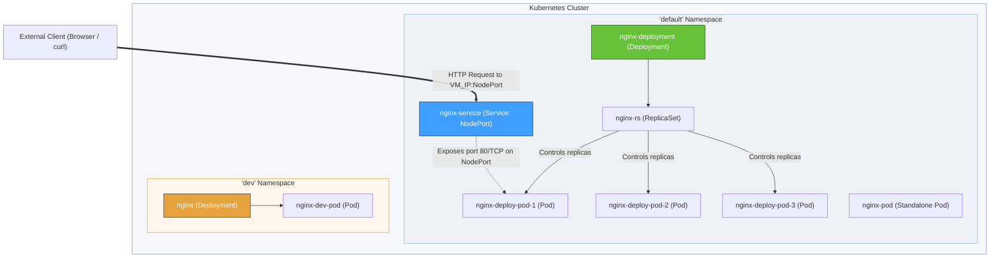

# Kubernetes Lab 2: Pods, ReplicaSets, Deployments, Services & Namespaces

A comprehensive, hands-on guide to mastering core Kubernetes workloads, networking, and logical resource isolation.

---

## Table of Contents
- [Objective](#-objective)
- [Architecture Diagram](#-architecture-diagram)
- [Prerequisites](#-prerequisites)
- [Step 1: Create Lab Directory](#step-1--create-lab-directory)
- [Step 2: Create and Manage Pods](#step-2--create-pod)
- [Step 3: Deploy ReplicaSets (Self-Healing)](#step-3--create-replicaset)
- [Step 4: Declarative Deployments](#step-4--create-deployment)
- [Step 5: Scale Deployments](#step-5--scale-deployment)
- [Step 6: Rolling Updates & Rollbacks](#step-6--rolling-update)
- [Step 7: Networking with Services (NodePort)](#step-7--create-service)
- [Step 8: Resource Isolation with Namespaces](#step-8--namespaces)
- [Step 9: Resource Cleanup](#step-9--cleanup)
- [Lab Outcomes](#-lab-outcome)

---

## Objective

In this lab, you will gain hands-on experience with:
* **Pods**: Deploying and inspecting the basic scheduling unit.
* **ReplicaSets**: Establishing self-healing and basic scaling.
* **Deployments**: Managing declarative state changes, scaling, and rollouts.
* **Services**: Exposing containerized applications to internal and external networks.
* **Namespaces**: Creating virtual cluster partitions for resource isolation.
* **Cleanup Best Practices**: Deleting resources efficiently.

---

## Architecture Diagram

This diagram visualizes how the components you create in this lab interact with each other within the Kubernetes cluster.



---

## Prerequisites

* **OS / Environment**: Ubuntu VM (or equivalent Linux-based environment)
* **Kubernetes Control Plane**: Running cluster with `kubectl` configured
* **Connectivity**: Active internet connection to pull public images (NGINX)

### Verify Cluster Connection

Run the following command to check if your cluster nodes are active:

```bash
kubectl get nodes
```

#### Expected Output
```text
NAME                     STATUS   ROLES           AGE   VERSION
mytfvm-fresh16442460     Ready    control-plane   23m   v1.28.2
```

---

## Step 1 : Create Lab Directory

Organize your configurations in a dedicated folder to avoid mixing up manifests.

```bash
mkdir ~/k8s-lab2
cd ~/k8s-lab2
pwd
```

---

## Step 2 : Create Pod

A **Pod** is the smallest deployable unit in Kubernetes, representing a single instance of a running process.

### 1. Define the Manifest
Create a file named `pod.yaml` using your favorite text editor (e.g., `nano` or `vim`):

```bash
nano pod.yaml
```

Paste the following definition into the file:

```yaml
apiVersion: v1
kind: Pod
metadata:
  name: nginx-pod
spec:
  containers:
  - name: nginx
    image: nginx
    ports:
    - containerPort: 80
```

> [!NOTE]
> **YAML Breakdown:**
> * `apiVersion`: Speaks to the version of the schema/API you are targeting (`v1` for Pods).
> * `kind`: Tells Kubernetes what resource type to create (`Pod`).
> * `metadata.name`: The unique string name identifier for this Pod.
> * `spec.containers`: The collection of container images and settings to launch in this Pod.
> * `containerPort`: Exposes port 80 of the NGINX container inside the Pod network.

Save and exit the editor:
* Press `Ctrl + O` then `Enter` (Write out)
* Press `Ctrl + X` (Exit editor)

### 2. Apply and Verify the Pod

```bash
# Create the Pod resource
kubectl apply -f pod.yaml

# Verify that the Pod is running
kubectl get pods
```

To see comprehensive configuration and status details:
```bash
kubectl describe pod nginx-pod
```

### 3. Retrieve Internal IP & Check Logs
Pods receive unique cluster-internal IPs. To view IP details:

```bash
kubectl get pod -o wide
```

To view stdout/stderr logs from the container running inside the Pod:
```bash
kubectl logs nginx-pod
```

### 4. Interactive Pod Execution
Execute commands inside the container directly using `kubectl exec`:

```bash
kubectl exec -it nginx-pod -- /bin/bash
```

Once inside the container shell, inspect the internal environment:
```bash
pwd
ls
cat /etc/os-release
hostname
hostname -i
ls /etc/nginx
cat /usr/share/nginx/html/index.html
```

To return to your VM shell, type:
```bash
exit
```

### 5. Remove Standalone Pod
```bash
kubectl delete pod nginx-pod
kubectl get pods
```

---

## Step 3 : Create ReplicaSet

A **ReplicaSet** ensures a specified number of identical Pod replicas are running at any given time, providing self-healing.

### 1. Define the Manifest
Create the `replicaset.yaml` file:

```bash
nano replicaset.yaml
```

Paste the following definition:

```yaml
apiVersion: apps/v1
kind: ReplicaSet
metadata:
  name: nginx-rs
spec:
  replicas: 3
  selector:
    matchLabels:
      app: nginx
  template:
    metadata:
      labels:
        app: nginx
    spec:
      containers:
      - name: nginx
        image: nginx
        ports:
        - containerPort: 80
```

> [!IMPORTANT]
> **Key Attributes:**
> * `spec.replicas`: The desired number of Pod instances (3).
> * `spec.selector.matchLabels`: Tells the ReplicaSet which Pods it owns.
> * `spec.template`: The pod template description. It must contain matching labels (`app: nginx`) to be detected by the selector.

### 2. Launch the ReplicaSet
```bash
kubectl apply -f replicaset.yaml
```

Verify that the ReplicaSet and its corresponding Pods are created:
```bash
kubectl get rs
kubectl get pods
```

Let's view details about how the ReplicaSet manages the Pod status:
```bash
kubectl describe rs nginx-rs
```

### 3. Test Self-Healing Capabilities
Let's see what happens if a Pod crashes or gets deleted.

1. Fetch your active Pod names:
   ```bash
   kubectl get pods
   ```
2. Delete one of the Pods:
   ```bash
   kubectl delete pod <replicaset-pod-name>
   ```
   *(Replace `<replicaset-pod-name>` with one of the Pod names displayed in step 1)*
3. Immediately list the pods again:
   ```bash
   kubectl get pods
   ```

> [!TIP]
> You will observe that a new Pod is instantly provisioned to replace the deleted one, keeping the cluster in the desired state of 3 replicas.

---

## Step 4 : Create Deployment

A **Deployment** provides declarative updates for Pods and ReplicaSets. It is the recommended resource for managing application lifecycles.

### 1. Define the Manifest
Create `deployment.yaml`:

```bash
nano deployment.yaml
```

Paste the configuration:

```yaml
apiVersion: apps/v1
kind: Deployment
metadata:
  name: nginx-deployment
spec:
  replicas: 3
  selector:
    matchLabels:
      app: nginx-deploy
  template:
    metadata:
      labels:
        app: nginx-deploy
    spec:
      containers:
      - name: nginx
        image: nginx:latest
        ports:
        - containerPort: 80
```

### 2. Apply and Verify the Deployment
```bash
# Deploy to cluster
kubectl apply -f deployment.yaml

# Verify resources
kubectl get deployments
kubectl get rs
kubectl get pods
```

> [!NOTE]
> Notice how the Deployment automatically creates a background ReplicaSet, which in turn manages the three Pods.

To view detailed rollout details:
```bash
kubectl describe deployment nginx-deployment
```

---

## Step 5 : Scale Deployment

Scaling updates the desired replica count, and Kubernetes automatically matches the infrastructure capacity.

### Scale Up to 5 Replicas
```bash
kubectl scale deployment nginx-deployment --replicas=5
kubectl get deployment
kubectl get pods
```

### Scale Down to 2 Replicas
```bash
kubectl scale deployment nginx-deployment --replicas=2
kubectl get pods
```

---

## Step 6 : Rolling Update

Deployments allow zero-downtime updates by rolling out new configurations incrementally.

### 1. Update the Container Image
Update NGINX to version `1.25`:

```bash
kubectl set image deployment/nginx-deployment nginx=nginx:1.25
```

### 2. Monitor Rollout Progress
```bash
kubectl rollout status deployment/nginx-deployment
```

Check the revision history:
```bash
kubectl rollout history deployment/nginx-deployment
```

### 3. Undo/Rollback the Update
If an update goes wrong, easily revert to the previous stable state:

```bash
kubectl rollout undo deployment/nginx-deployment
```

---

## Step 7 : Create Service

A **Service** provides a stable network endpoint (IP address and DNS entry) to direct traffic to dynamic Pods. We'll use a `NodePort` Service to expose our deployment externally.

### 1. Define the Manifest
Create `service.yaml`:

```bash
nano service.yaml
```

Paste the configuration:

```yaml
apiVersion: v1
kind: Service
metadata:
  name: nginx-service
spec:
  selector:
    app: nginx-deploy
  ports:
  - protocol: TCP
    port: 80
    targetPort: 80
  type: NodePort
```

> [!NOTE]
> * `spec.selector`: Directs incoming traffic to any Pod matching label `app: nginx-deploy`.
> * `spec.ports.port`: The port exposed on the cluster-internal Service IP.
> * `spec.ports.targetPort`: The port the container is listening on (port 80).
> * `spec.type`: `NodePort` allocates a high port (usually range 30000-32767) on all Cluster Nodes so traffic is routable from outside the cluster.

### 2. Create the Service
```bash
kubectl apply -f service.yaml
```

### 3. Verify the Endpoint Mapping
```bash
kubectl get svc
kubectl describe svc nginx-service
kubectl get endpoints nginx-service
```

### 4. Test Connectivity

#### A. From within the VM Host
Run `curl` targeting the allocated random NodePort:

```bash
curl http://localhost:<NodePort>
```
*(Example: `curl http://localhost:32277`)*

#### B. From an External Browser
Retrieve the public IP of your VM hosting Kubernetes, then visit:
```text
http://<VM_Public_IP>:<NodePort>
```
*(Example: `http://172.177.125.22:32277`)*

---

## Step 8 : Namespaces

**Namespaces** allow you to partition a single Kubernetes cluster into multiple virtual clusters, separating development environments (e.g., `dev`, `stage`, `prod`).

### 1. Create a Namespace
Check existing namespaces first:
```bash
kubectl get namespaces
```

Create a new namespace named `dev`:
```bash
kubectl create namespace dev
kubectl get namespaces
```

### 2. Deploy to Specific Namespaces
By default, commands execute inside the `default` namespace. Use `-n <namespace>` to target a custom namespace:

```bash
# Create deployment in the dev namespace
kubectl create deployment nginx --image=nginx -n dev

# Verify deployment & pods in dev namespace
kubectl get deployments -n dev
kubectl get pods -n dev
```

### 3. Verify Isolation
Let's see if the Pod is visible in the `default` namespace:
```bash
kubectl get pods
```
> [!NOTE]
> You will notice that the `nginx` pod in the `dev` namespace is completely hidden from the default scope.

### 4. Inspect and Delete Namespace
```bash
kubectl describe namespace dev

# Deleting a namespace automatically removes all nested resources
kubectl delete namespace dev

# Verify deletion
kubectl get namespaces
```

---

## Step 9 : Cleanup

Always clean up your resources after completing a lab session to free up system capacity.

```bash
# Delete all resources created in this lab
kubectl delete deployment nginx-deployment
kubectl delete replicaset nginx-rs
kubectl delete service nginx-service
kubectl delete pod nginx-pod

# Verify active resources (expected only standard Kubernetes ClusterIP service)
kubectl get all
```

### Optional Cleanups
If you have leftover deployments from other labs:
```bash
kubectl delete deployment demo
kubectl delete deployment nginx
```

### Final Verification
```bash
kubectl get all
```

#### Expected Output
```text
NAME                 TYPE        CLUSTER-IP      EXTERNAL-IP   PORT(S)        AGE
service/kubernetes   ClusterIP   10.96.0.1       <none>        443/TCP        4h
```

---

## Lab Outcomes

Upon completion, you have successfully verified and mastered the following Kubernetes concepts:

- [x] **Kubernetes Pods**: Creating, describing, inspecting, and deleting isolated instances.
- [x] **ReplicaSets**: Establishing replica targets and testing automated self-healing.
- [x] **Deployments**: Running declarative containers, scaling up/down, and executing zero-downtime updates.
- [x] **Rollbacks**: Using rollout undo commands to recover from bad updates.
- [x] **Services**: Exposing workload containers externally via `NodePort`.
- [x] **Namespaces**: Partitioning resources dynamically for multi-tenant environments.
- [x] **Cleanup Procedures**: Safely sweeping away resources to keep the cluster healthy.

**Congratulations on completing Lab 2!**
