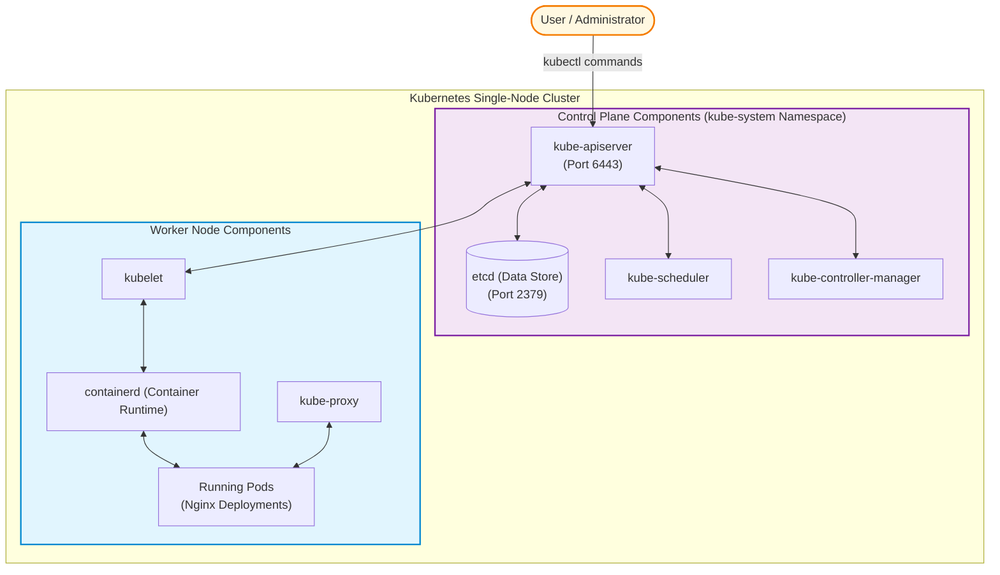

# Kubernetes Architecture & Control Plane Components
## Practical Lab Activity (Single-Node Kubernetes Lab)

Welcome to the **Kubernetes Control Plane and Node Architecture Lab**. This practical guide provides a step-by-step walk-through to install, inspect, verify, and interact with the core components of a single-node Kubernetes cluster. 

By the end of this lab, you will understand how the Control Plane (API Server, Scheduler, Controller Manager, `etcd`) communicates with Node components (`kubelet`, `kube-proxy`, container runtime) to schedule and self-heal workloads.

---

## Architecture Overview

The diagram below illustrates the communication flow between the control plane components and the worker node components in our single-node cluster:



---

## Table of Contents

1. [Cluster Setup & Installation](#1-cluster-setup--installation)
   - [Step 1: Verify Installation Script](#step-1-verify-installation-script)
   - [Step 2: Make Script Executable](#step-2-make-script-executable)
   - [Step 3: Install Kubernetes Automatically](#step-3-install-kubernetes-automatically)
2. [Cluster Verification](#2-cluster-verification)
   - [Step 4: Verify Cluster Info](#step-4-verify-cluster-info)
   - [Step 5: Verify Node Status](#step-5-verify-node-status)
   - [Step 6: View Control Plane Pods](#step-6-view-control-plane-pods)
3. [Deep-Dive: Inspecting Control Plane Components](#3-deep-dive-inspecting-control-plane-components)
   - [Step 7: Explore API Server](#step-7-explore-api-server)
   - [Step 8: Explore etcd](#step-8-explore-etcd)
   - [Step 9: Explore Scheduler](#step-9-explore-scheduler)
   - [Step 10: Explore Controller Manager](#step-10-explore-controller-manager)
   - [Step 11: Explore Worker Node Attributes](#step-11-explore-worker-node-attributes)
4. [Workload Deployment & Scheduling](#4-workload-deployment--scheduling)
   - [Step 12: Remove Control Plane Taint](#step-12-remove-control-plane-taint-single-node-only)
   - [Step 13: Create Nginx Deployment](#step-13-create-nginx-deployment)
   - [Step 14: Check Scheduled Pods](#step-14-check-scheduled-pods)
   - [Step 15: Scale Deployment](#step-15-scale-deployment)
   - [Step 16: Verify Scale-up](#step-16-verify-scale-up)
5. [Self-Healing & Resource Analysis](#5-self-healing--resource-analysis)
   - [Step 17: Simulate Pod Failure](#step-17-simulate-pod-failure)
   - [Step 18: Watch Self-Healing in Real Time](#step-18-watch-self-healing-in-real-time)
   - [Step 19: View Deployments](#step-19-view-deployments)
   - [Step 20: View ReplicaSets](#step-20-view-replicasets)
   - [Step 21: View Services](#step-21-view-services)
   - [Step 22: View All Cluster Resources](#step-22-view-all-cluster-resources)
6. [Cleanup & Reference](#6-cleanup--reference)
   - [Step 23: Clean up Resources](#step-23-clean-up-resources)
   - [Complete Command Quick-Reference](#complete-command-quick-reference)

---

# Clone Repository

```bash
git clone https://github.com/shubhsalunke/RPI.git
```

```bash
cd Kubernetes Architecture
```

## 1. Cluster Setup & Installation

### Step 1: Verify Installation Script
Ensure that the setup script `install-kubernetes.sh` is present in your current working directory.

```bash
ls -l install-kubernetes.sh
```

**Expected Output:**
```text
-rw-r--r-- 1 user user 1234 Jul 15 12:00 install-kubernetes.sh
```

---

### Step 2: Make Script Executable
Add execution permissions to the script so it can run.

```bash
chmod +x install-kubernetes.sh
```

---

### Step 3: Install Kubernetes Automatically
Run the script with superuser privileges to bootstrap the single-node cluster.

```bash
sudo ./install-kubernetes.sh
```

> [!NOTE]
> This script installs container runtimes (`containerd`), configures network plugins (CNI like Calico), and initializes the Kubernetes cluster via `kubeadm`.

Wait until you see the confirmation message:
```text
Kubernetes Installation Completed Successfully
```

---

## 2. Cluster Verification

### Step 4: Verify Cluster Info
Verify that the `kubectl` CLI tool is configured correctly and is communicating with the control plane API server.

```bash
kubectl cluster-info
```

**Expected Output:**
```text
Kubernetes control plane is running at https://127.0.0.1:6443
CoreDNS is running at https://127.0.0.1:6443/api/v1/namespaces/kube-system/services/kube-dns:dns/proxy

To further debug and diagnose cluster problems, use 'kubectl cluster-info dump'.
```

---

### Step 5: Verify Node Status
Check the status of the local single-node cluster node.

```bash
kubectl get nodes -o wide
```

**Expected Output:**
```text
NAME             STATUS   ROLES           AGE   VERSION   INTERNAL-IP   EXTERNAL-IP   OS-IMAGE             KERNEL-VERSION     CONTAINER-RUNTIME
mytfvm-control   Ready    control-plane   5m    v1.28.x   10.0.0.4      <none>        Ubuntu 22.04.3 LTS   5.15.0-xx-generic  containerd://1.7.x
```

---

### Step 6: View Control Plane Pods
Examine the pods running in the system namespace `kube-system` to see the core components running as static pods.

```bash
kubectl get pods -n kube-system
```

**Expected Components list to look for:**
* `kube-apiserver-mytfvm-control` (API Gateway)
* `etcd-mytfvm-control` (Database/Store)
* `kube-scheduler-mytfvm-control` (Scheduler)
* `kube-controller-manager-mytfvm-control` (Controllers)
* `kube-proxy-xxxxx` (Network proxy)
* `coredns-xxxxxx` (Internal DNS resolution)
* `calico-node-xxxxx` or other CNI pod (Network plugin)

---

## 3. Deep-Dive: Inspecting Control Plane Components

### Step 7: Explore API Server
The **kube-apiserver** is the front-end for the Kubernetes control plane. It exposes the HTTP API that handles all REST requests.

```bash
kubectl describe pod -n kube-system kube-apiserver-$(hostname)
```

> [!TIP]
> **What to inspect in the output:**
> * **Port:** Look for `--secure-port=6443`. This is the TLS-secured port for api requests.
> * **Certificates:** Note the file paths starting with `/etc/kubernetes/pki/`. Every request must be authenticated and authorized.
> * **Volumes:** Observe host mounts mapping `/etc/ssl/certs` and `/etc/kubernetes/pki` into the pod.

---

### Step 8: Explore etcd
**etcd** is the highly available, consistent key-value store used as Kubernetes' backing store for all cluster data.

```bash
kubectl describe pod -n kube-system etcd-$(hostname)
```

> [!IMPORTANT]
> **Key Database Attributes:**
> * **Client Port:** `--listen-client-urls=https://127.0.0.1:2379`.
> * **Data Directory:** Notice `--data-dir=/var/lib/etcd`. This is where all configuration, secrets, and system states are persisted. Losing this directory means losing your cluster config!

---

### Step 9: Explore Scheduler
The **kube-scheduler** watches for newly created Pods with no assigned node, and selects a node for them to run on.

```bash
kubectl describe pod -n kube-system kube-scheduler-$(hostname)
```

> [!NOTE]
> **Observe Scheduler Configuration:**
> * **Leader Election:** Observe parameter `--leader-elect=true`. In multi-master setups, only one active scheduler schedules pods while others remain in standby mode.
> * **Scheduling Policies:** Default settings balance CPU/Memory request distribution across worker nodes.

---

### Step 10: Explore Controller Manager
The **kube-controller-manager** runs controller processes that regulate the state of the cluster (e.g. Node Controller, Job Controller, EndpointSlice Controller).

```bash
kubectl describe pod -n kube-system kube-controller-manager-$(hostname)
```

> [!NOTE]
> **Key Parameters:**
> * **Controllers:** Employs `--controllers=*` to start all standard controllers.
> * **Leader Election:** Uses `--leader-elect=true` to guarantee only one controller manager writes changes to the API server at a time.

---

### Step 11: Explore Worker Node Attributes
Query the physical attributes and runtime capacities of the local Node.

```bash
kubectl describe node $(hostname)
```

> [!TIP]
> **Attributes to look for:**
> * **Conditions:** Look for `Ready=True`, `MemoryPressure=False`, `DiskPressure=False`, `PIDPressure=False`.
> * **Capacity & Allocatable:** Check available CPUs, Memory, and maximum assignable Pods.
> * **PodCIDR:** The IP address subnet allocated for Pods running on this specific node (e.g., `172.16.0.0/24`).

---

## 4. Workload Deployment & Scheduling

### Step 12: Remove Control Plane Taint (Single-Node Only)
By default, control-plane nodes have a `NoSchedule` taint, preventing workloads from running on them. Since this is a single-node lab, we must untaint it so our test pods can run.

```bash
kubectl taint nodes --all node-role.kubernetes.io/control-plane-
```

**Verify Taint Removal:**
```bash
kubectl describe node $(hostname) | grep Taints
```

**Expected Output:**
```text
Taints:             <none>
```

---

### Step 13: Create Nginx Deployment
Create a deployment which defines the desired state of running the official Nginx container image.

```bash
kubectl create deployment nginx --image=nginx
```

---

### Step 14: Check Scheduled Pods
Confirm the pod has transitioned to a running status and verify which node it has been scheduled to run on.

```bash
kubectl get pods -o wide
```

**Expected Output:**
```text
NAME                     READY   STATUS    RESTARTS   AGE   IP           NODE             NOMINATED NODE   READINESS GATES
nginx-77b4fdf86c-xxxxx   1/1     Running   0          10s   172.16.0.5   mytfvm-control   <none>           <none>
```

> [!NOTE]
> This proves the **Scheduler** successfully bound the Pod to the local worker node, and the local **kubelet** pulled the image and started the container via **containerd**.

---

### Step 15: Scale Deployment
Scale up the deployment to run 3 instances (replicas) of the Nginx application.

```bash
kubectl scale deployment nginx --replicas=3
```

---

### Step 16: Verify Scale-up
Check the state of the pods.

```bash
kubectl get pods
```

**Expected Output:**
```text
NAME                     READY   STATUS    RESTARTS   AGE
nginx-77b4fdf86c-54f2x   1/1     Running   0          45s
nginx-77b4fdf86c-abcde   1/1     Running   0          5s
nginx-77b4fdf86c-xyz12   1/1     Running   0          5s
```

---

## 5. Self-Healing & Resource Analysis

### Step 17: Simulate Pod Failure
To demonstrate Kubernetes self-healing capabilities, retrieve the name of one of the active Nginx pods and delete it.

```bash
# Get current pod names
kubectl get pods
```

Delete a specific pod:
```bash
kubectl delete pod <pod-name>
```

*Example:*
```bash
kubectl delete pod nginx-77b4fdf86c-54f2x
```

---

### Step 18: Watch Self-Healing in Real Time
Immediately run the following command to watch pod lifecycle changes:

```bash
kubectl get pods -w
```

> [!NOTE]
> **What Happens Here:**
> 1. The **ReplicaSet Controller** notices the running pods count dropped to `2`, but the desired count is `3`.
> 2. It sends a request to the **API Server** to launch a new pod.
> 3. The **Scheduler** identifies the node to place the pod.
> 4. The **kubelet** on the node starts the new container.
> 5. Press `CTRL+C` to terminate the watch command when all pods are `Running`.

---

### Step 19: View Deployments
Verify that the `nginx` deployment matches its desired configurations.

```bash
kubectl get deployments
```

**Expected Output:**
```text
NAME    READY   UP-TO-DATE   AVAILABLE   AGE
nginx   3/3     3            3           5m
```

---

### Step 20: View ReplicaSets
Inspect the ReplicaSet controller managing the lifecycle of your application pods.

```bash
kubectl get replicasets
```

**Expected Output:**
```text
NAME               DESIRED   CURRENT   READY   AGE
nginx-77b4fdf86c   3         3         3       5m
```

---

### Step 21: View Services
Query active Services in the default namespace.

```bash
kubectl get svc
```

**Expected Output:**
```text
NAME         TYPE        CLUSTER-IP   EXTERNAL-IP   PORT(S)   AGE
kubernetes   ClusterIP   10.96.0.1    <none>        443/TCP   10m
```

---

### Step 22: View All Cluster Resources
Get a comprehensive view of all resources deployed within the default namespace.

```bash
kubectl get all
```

---

## 6. Cleanup & Reference

### Step 23: Clean up Resources
Remove the deployment to clean up all pods, freeing memory/CPU.

```bash
kubectl delete deployment nginx
```

Verify that the namespace is clear:
```bash
kubectl get all
```

---

### Complete Command Quick-Reference
For advanced users who want to run the commands sequentially without descriptions:

```bash
# Install & Setup
chmod +x install-kubernetes.sh
sudo ./install-kubernetes.sh

# Verify Cluster Status
kubectl cluster-info
kubectl get nodes -o wide
kubectl get pods -n kube-system

# Explore Control Plane Pods
kubectl describe pod -n kube-system kube-apiserver-$(hostname)
kubectl describe pod -n kube-system etcd-$(hostname)
kubectl describe pod -n kube-system kube-scheduler-$(hostname)
kubectl describe pod -n kube-system kube-controller-manager-$(hostname)
kubectl describe node $(hostname)

# Deploy and Untaint Node
kubectl taint nodes --all node-role.kubernetes.io/control-plane-
kubectl describe node $(hostname) | grep Taints
kubectl create deployment nginx --image=nginx
kubectl get pods -o wide

# Scaling and Self-Healing Demo
kubectl scale deployment nginx --replicas=3
kubectl get pods
# Note: replace with your actual pod name
kubectl delete pod <pod-name> 
kubectl get pods -w

# Check Resource Architecture
kubectl get deployments
kubectl get replicasets
kubectl get svc
kubectl get all

# Cleanup
kubectl delete deployment nginx
kubectl get all
```
